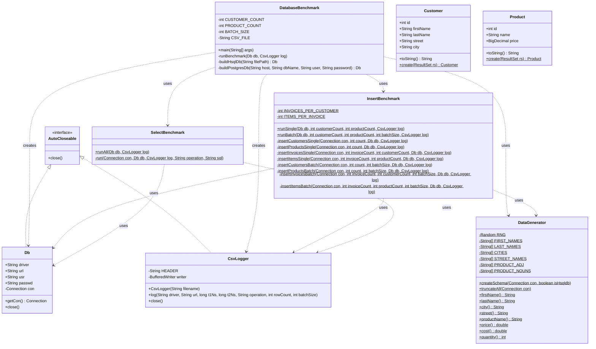

```mermaid
classDiagram
    direction TB

    class DatabaseBenchmark {
        -int CUSTOMER_COUNT
        -int PRODUCT_COUNT
        -int BATCH_SIZE
        -String CSV_FILE
        +main(String[] args)
        -runBenchmark(Db db, CsvLogger log)
        -buildHsqlDb(String filePath) Db
        -buildPostgresDb(String host, String dbName, String user, String password) Db
    }

    class Db {
        +String driver
        +String url
        +String usr
        +String passwd
        -Connection con
        +getCon() Connection
        +close()
    }

    class Customer {
        +int id
        +String firstName
        +String lastName
        +String street
        +String city
        +toString() String
        +create(ResultSet rs)$ Customer
    }

    class Product {
        +int id
        +String name
        +BigDecimal price
        +toString() String
        +create(ResultSet rs)$ Product
    }

    class CsvLogger {
        -String HEADER
        -BufferedWriter writer
        +CsvLogger(String filename)
        +log(String driver, String url, long t1Ns, long t2Ns, String operation, int rowCount, int batchSize)
        +close()
    }

    class DataGenerator {
        -Random RNG$
        -String[] FIRST_NAMES$
        -String[] LAST_NAMES$
        -String[] CITIES$
        -String[] STREET_NAMES$
        -String[] PRODUCT_ADJ$
        -String[] PRODUCT_NOUNS$
        +createSchema(Connection con, boolean isHsqldb)$
        +truncateAll(Connection con)$
        +firstName()$ String
        +lastName()$ String
        +city()$ String
        +street()$ String
        +productName()$ String
        +price()$ double
        +cost()$ double
        +quantity()$ int
    }

    class InsertBenchmark {
        -int INVOICES_PER_CUSTOMER$
        -int ITEMS_PER_INVOICE$
        +runSingle(Db db, int customerCount, int productCount, CsvLogger log)$
        +runBatch(Db db, int customerCount, int productCount, int batchSize, CsvLogger log)$
        -insertCustomersSingle(Connection con, int count, Db db, CsvLogger log)$
        -insertProductsSingle(Connection con, int count, Db db, CsvLogger log)$
        -insertInvoicesSingle(Connection con, int invoiceCount, int customerCount, Db db, CsvLogger log)$
        -insertItemsSingle(Connection con, int invoiceCount, int productCount, Db db, CsvLogger log)$
        -insertCustomersBatch(Connection con, int count, int batchSize, Db db, CsvLogger log)$
        -insertProductsBatch(Connection con, int count, int batchSize, Db db, CsvLogger log)$
        -insertInvoicesBatch(Connection con, int invoiceCount, int customerCount, int batchSize, Db db, CsvLogger log)$
        -insertItemsBatch(Connection con, int invoiceCount, int productCount, int batchSize, Db db, CsvLogger log)$
    }

    class SelectBenchmark {
        +runAll(Db db, CsvLogger log)$
        -run(Connection con, Db db, CsvLogger log, String operation, String sql)$
    }

    class AutoCloseable {
        <<interface>>
        +close()
    }

    AutoCloseable <|.. Db
    AutoCloseable <|.. CsvLogger

    DatabaseBenchmark ..> Db : creates
    DatabaseBenchmark ..> CsvLogger : creates
    DatabaseBenchmark ..> DataGenerator : uses
    DatabaseBenchmark ..> InsertBenchmark : uses
    DatabaseBenchmark ..> SelectBenchmark : uses

    InsertBenchmark ..> Db : uses
    InsertBenchmark ..> CsvLogger : uses
    InsertBenchmark ..> DataGenerator : uses

    SelectBenchmark ..> Db : uses
    SelectBenchmark ..> CsvLogger : uses
```
