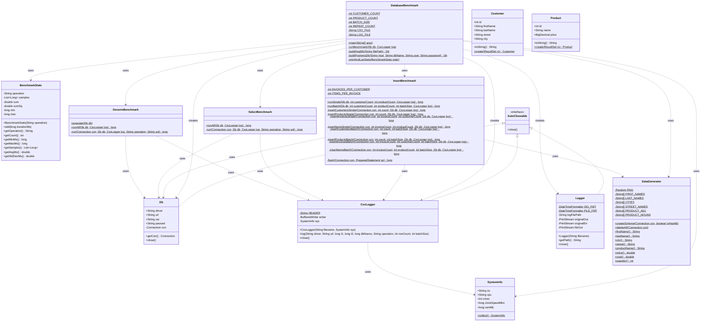

# Onlineshop - UML-Klassendiagramm

```mermaid
classDiagram
    direction TB

    class DatabaseBenchmark {
        -int CUSTOMER_COUNT$
        -int PRODUCT_COUNT$
        -int BATCH_SIZE$
        -int REPEAT_COUNT$
        -String CSV_FILE$
        -String LOG_FILE$
        +main(String[] args)$
        -runBenchmark(Db db, CsvLogger log)$
        -buildHsqlDb(String filePath)$ Db
        -buildPostgresDb(String host, String dbName, String user, String password)$ Db
        -printAndLogStats(BenchmarkStats stats)$
    }

    class Db {
        +String driver
        +String url
        +String usr
        +String passwd
        -Connection con
        +getCon() Connection
        +close()
    }

    class Customer {
        +int id
        +String firstName
        +String lastName
        +String street
        +String city
        +toString() String
        +create(ResultSet rs)$ Customer
    }

    class Product {
        +int id
        +String name
        +BigDecimal price
        +toString() String
        +create(ResultSet rs)$ Product
    }

    class CsvLogger {
        -String HEADER$
        -BufferedWriter writer
        -SystemInfo sys
        +CsvLogger(String filename, SystemInfo sys)
        +log(String driver, String url, long t1, long t2, long dbNanos, String operation, int rowCount, int batchSize)
        +close()
    }

    class Logger {
        -DateTimeFormatter ISO_FMT$
        -DateTimeFormatter FILE_FMT$
        -String logFilePath
        -PrintStream originalOut
        -PrintStream originalErr
        -PrintStream fileOut
        +Logger(String filename)
        +getPath() String
        +close()
    }

    class SystemInfo {
        +String os
        +String cpu
        +int cores
        +long clockSpeedMhz
        +long ramMb
        +collect()$ SystemInfo
    }

    class BenchmarkStats {
        -String operation
        -List~Long~ samples
        -double sum
        -double sumSq
        -long min
        -long max
        +BenchmarkStats(String operation)
        +add(long durationMs)
        +getOperation() String
        +getCount() int
        +getMinMs() long
        +getMaxMs() long
        +getSamples() List~Long~
        +getAvgMs() double
        +getStdDevMs() double
    }

    class DataGenerator {
        -Random RNG$
        -String[] FIRST_NAMES$
        -String[] LAST_NAMES$
        -String[] CITIES$
        -String[] STREET_NAMES$
        -String[] PRODUCT_ADJ$
        -String[] PRODUCT_NOUNS$
        +createSchema(Connection con, boolean isHsqldb)$
        +deleteAll(Connection con)$
        +firstName()$ String
        +lastName()$ String
        +city()$ String
        +street()$ String
        +productName()$ String
        +price()$ double
        +cost()$ double
        +quantity()$ int
    }

    class InsertBenchmark {
        -int INVOICES_PER_CUSTOMER$
        -int ITEMS_PER_INVOICE$
        +runSingle(Db db, int customerCount, int productCount, CsvLogger log)$ long
        +runBatch(Db db, int customerCount, int productCount, int batchSize, CsvLogger log)$ long
        -insertCustomersSingle(Connection con, int count, Db db, CsvLogger log)$ long
        -insertProductsSingle(Connection con, int count, Db db, CsvLogger log)$ long
        -insertInvoicesSingle(Connection con, int invoiceCount, int customerCount, Db db, CsvLogger log)$ long
        -insertItemsSingle(Connection con, int invoiceCount, int productCount, Db db, CsvLogger log)$ long
        -insertCustomersBatch(Connection con, int count, int batchSize, Db db, CsvLogger log)$ long
        -insertProductsBatch(Connection con, int count, int batchSize, Db db, CsvLogger log)$ long
        -insertInvoicesBatch(Connection con, int invoiceCount, int customerCount, int batchSize, Db db, CsvLogger log)$ long
        -insertItemsBatch(Connection con, int invoiceCount, int productCount, int batchSize, Db db, CsvLogger log)$ long
        -flush(Connection con, PreparedStatement ps)$ long
    }

    class SelectBenchmark {
        +runAll(Db db, CsvLogger log)$ long
        -run(Connection con, Db db, CsvLogger log, String operation, String sql)$ long
    }

    class DenormBenchmark {
        +populate(Db db)$
        +runAll(Db db, CsvLogger log)$ long
        -run(Connection con, Db db, CsvLogger log, String operation, String sql)$ long
    }

    class AutoCloseable {
        <<interface>>
        +close()
    }

    AutoCloseable <|.. Db
    AutoCloseable <|.. CsvLogger
    AutoCloseable <|.. Logger

    DatabaseBenchmark ..> Db : creates
    DatabaseBenchmark ..> CsvLogger : creates
    DatabaseBenchmark ..> Logger : creates
    DatabaseBenchmark ..> SystemInfo : uses
    DatabaseBenchmark ..> DataGenerator : uses
    DatabaseBenchmark ..> InsertBenchmark : uses
    DatabaseBenchmark ..> SelectBenchmark : uses
    DatabaseBenchmark ..> DenormBenchmark : uses
    DatabaseBenchmark ..> BenchmarkStats : uses

    CsvLogger ..> SystemInfo : uses

    InsertBenchmark ..> Db : uses
    InsertBenchmark ..> CsvLogger : uses
    InsertBenchmark ..> DataGenerator : uses

    SelectBenchmark ..> Db : uses
    SelectBenchmark ..> CsvLogger : uses

    DenormBenchmark ..> Db : uses
    DenormBenchmark ..> CsvLogger : uses
```
