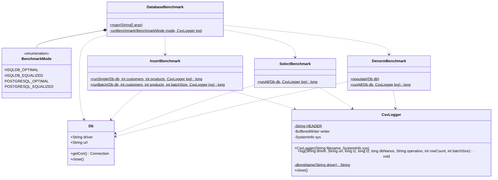

```mermaid
classDiagram
    direction TB

    class DatabaseBenchmark {
        +main(String[] args)$
        -runBenchmark(BenchmarkMode mode, CsvLogger log)$
    }

    class BenchmarkMode {
        <<enumeration>>
        HSQLDB_OPTIMAL
        HSQLDB_EQUALIZED
        POSTGRESQL_OPTIMAL
        POSTGRESQL_EQUALIZED
    }

    class Db {
        +String driver
        +String url
        +getCon() Connection
        +close()
    }

    class InsertBenchmark {
        +runSingle(Db db, int customers, int products, CsvLogger log)$ long
        +runBatch(Db db, int customers, int products, int batchSize, CsvLogger log)$ long
    }

    class SelectBenchmark {
        +runAll(Db db, CsvLogger log)$ long
    }

    class DenormBenchmark {
        +populate(Db db)$
        +runAll(Db db, CsvLogger log)$ long
    }

    class CsvLogger {
        -String HEADER$
        -BufferedWriter writer
        -SystemInfo sys
        +CsvLogger(String filename, SystemInfo sys)
        +log(String driver, String url, long t1, long t2, long dbNanos, String operation, int rowCount, int batchSize): void
        -dbmsName(String driver)$ String
        +close()
    }

    DatabaseBenchmark *-- BenchmarkMode

    DatabaseBenchmark ..> Db
    DatabaseBenchmark ..> InsertBenchmark
    DatabaseBenchmark ..> SelectBenchmark
    DatabaseBenchmark ..> DenormBenchmark

    InsertBenchmark ..> Db
    SelectBenchmark ..> Db
    DenormBenchmark ..> Db

    InsertBenchmark ..> CsvLogger
    SelectBenchmark ..> CsvLogger
    DenormBenchmark ..> CsvLogger
```