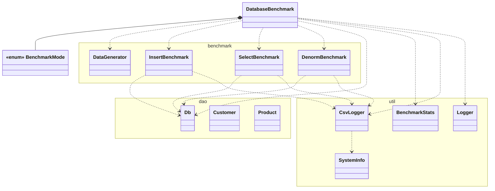

# DatabaseBenchmark - Class Diagram (simple)

```mermaid
classDiagram
    direction TB

    class DatabaseBenchmark["DatabaseBenchmark"]
    class BenchmarkMode["«enum» BenchmarkMode"]

    namespace benchmark {
        class DataGenerator
        class InsertBenchmark
        class SelectBenchmark
        class DenormBenchmark
    }

    namespace dao {
        class Db
        class Customer
        class Product
    }

    namespace util {
        class BenchmarkStats
        class CsvLogger
        class Logger
        class SystemInfo
    }

    DatabaseBenchmark *-- BenchmarkMode

    DatabaseBenchmark ..> DataGenerator
    DatabaseBenchmark ..> InsertBenchmark
    DatabaseBenchmark ..> SelectBenchmark
    DatabaseBenchmark ..> DenormBenchmark
    DatabaseBenchmark ..> Db
    DatabaseBenchmark ..> BenchmarkStats
    DatabaseBenchmark ..> CsvLogger
    DatabaseBenchmark ..> Logger

    InsertBenchmark ..> Db
    SelectBenchmark ..> Db
    DenormBenchmark ..> Db

    InsertBenchmark ..> CsvLogger
    SelectBenchmark ..> CsvLogger
    DenormBenchmark ..> CsvLogger

    CsvLogger ..> SystemInfo
```
