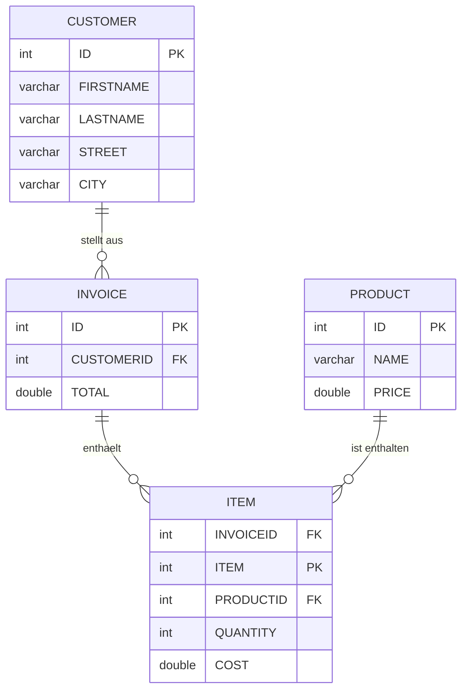

# Onlineshop - ER-Diagram

```mermaid
erDiagram
    CUSTOMER {
        int ID PK
        varchar FIRSTNAME
        varchar LASTNAME
        varchar STREET
        varchar CITY
    }

    INVOICE {
        int ID PK
        int CUSTOMERID FK
        double TOTAL
    }

    ITEM {
        int INVOICEID FK
        int ITEM PK
        int PRODUCTID FK
        int QUANTITY
        double COST
    }

    PRODUCT {
        int ID PK
        varchar NAME
        double PRICE
    }

    CUSTOMER ||--o{ INVOICE : "stellt aus"
    INVOICE ||--o{ ITEM : enthaelt
    PRODUCT ||--o{ ITEM : "ist enthalten"
```
