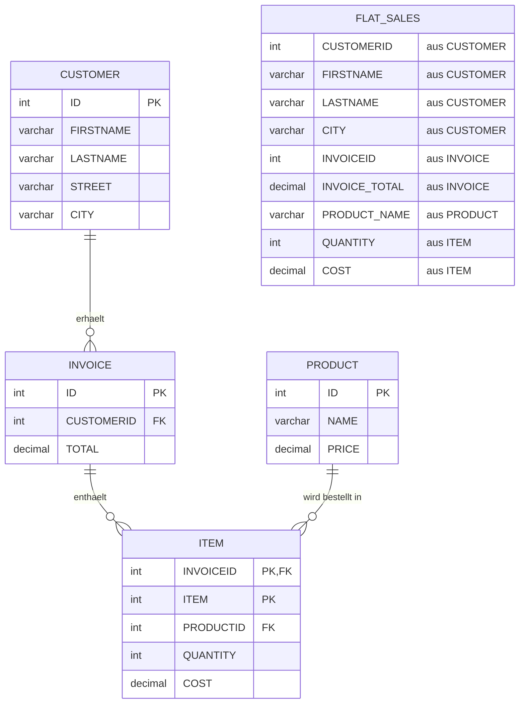

# DatabaseBenchmark - ER-Diagram

```mermaid
erDiagram
    CUSTOMER {
        int ID PK
        varchar FIRSTNAME
        varchar LASTNAME
        varchar STREET
        varchar CITY
    }

    INVOICE {
        int ID PK
        int CUSTOMERID FK
        decimal TOTAL
    }

    ITEM {
        int INVOICEID PK,FK
        int ITEM PK
        int PRODUCTID FK
        int QUANTITY
        decimal COST
    }

    PRODUCT {
        int ID PK
        varchar NAME
        decimal PRICE
    }

    FLAT_SALES {
        int CUSTOMERID "aus CUSTOMER"
        varchar FIRSTNAME "aus CUSTOMER"
        varchar LASTNAME "aus CUSTOMER"
        varchar CITY "aus CUSTOMER"
        int INVOICEID "aus INVOICE"
        decimal INVOICE_TOTAL "aus INVOICE"
        varchar PRODUCT_NAME "aus PRODUCT"
        int QUANTITY "aus ITEM"
        decimal COST "aus ITEM"
    }

    CUSTOMER ||--o{ INVOICE : "erhaelt"
    INVOICE ||--o{ ITEM : "enthaelt"
    PRODUCT ||--o{ ITEM : "wird bestellt in"
```
