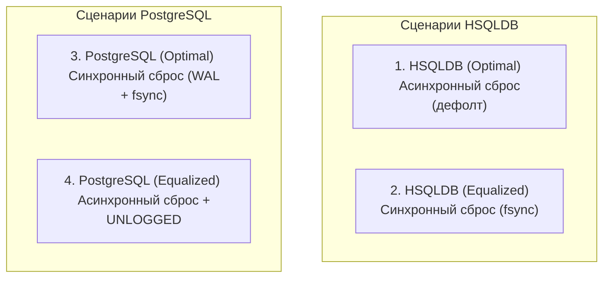

# Отчет об уравнивании условий бенчмаркинга: HSQLDB vs PostgreSQL

Этот документ подробно описывает методологию, теоретическую базу и результаты эксперимента по уравниванию условий тестирования встраиваемой файловой СУБД **HSQLDB** и клиент-серверной СУБД **PostgreSQL**.

---

## 1. Исходное состояние бенчмарка (до изменений)

В первоначальной версии бенчмарка проводилось сравнение производительности двух СУБД при дефолтных настройках подключения:
* **HSQLDB:** использовалась файловая база данных (`jdbc:hsqldb:file:./data/onlineshop`), работающая со схемой таблиц типа `CACHED` (данные хранятся в файле на диске, в оперативной памяти удерживается только кэш).
* **PostgreSQL:** использовалась стандартная установка СУБД с локальным подключением (`jdbc:postgresql://localhost/onlineshop`).

Тестировались следующие фазы:
1. `INSERT_SINGLE` (поштучная вставка 10 000 записей в автокоммите).
2. `INSERT_BATCH` (пакетная вставка 10 000 записей пачками по 1000 строк).
3. `SELECT_JOIN` (сложные выборки с объединением 3-4 нормализованных таблиц).
4. `SELECT_DENORM` (выборки из одной денормализованной таблицы).

---

## 2. Проблема старого подхода (Неравные условия)

Первоначальное сравнение страдало от фундаментальной методологической ошибки: **базы данных тестировались в совершенно разных условиях надежности и транзакционной логики.**

### Асинхронная запись (HSQLDB) против Синхронной (Postgres)
* По умолчанию HSQLDB использует так называемую **отложенную запись (write delay)** (обычно равную 500 миллисекундам). Это означает, что при выполнении коммита транзакции HSQLDB не записывает данные на диск сразу, а буферизирует их в оперативной памяти и сбрасывает на диск асинхронно раз в полсекунды. С точки зрения приложения, коммиты происходят мгновенно.
* PostgreSQL по умолчанию работает в режиме **максимальной надежности**. При каждом коммите транзакции Postgres блокирует поток выполнения приложения до тех пор, пока данные транзакции не будут записаны в WAL-файл (Write-Ahead Log) на физический накопитель, и операционная система не подтвердит успешный сброс дискового кэша (`fsync`).

### Архитектурное различие: Встраиваемая (Embedded) против Клиент-серверной
* HSQLDB работала во встроенном режиме (In-Process), выполняя все SQL-команды в рамках того же процесса JVM, в котором запущен бенчмарк.
* Postgres работал как независимый процесс операционной системы. Даже при локальном запуске (через `localhost`) каждый запрос к Postgres требовал прохождения через сетевой стек ОС (петлевой интерфейс Loopback / сокеты).

**Вывод:** Из-за этих различий HSQLDB имела колоссальное и нечестное преимущество при операциях записи, поскольку она не выполняла блокирующие операции записи на физический диск при каждом коммите.

---

## 3. Новый подход к тестированию (Уравнивание)

Для обеспечения научной достоверности и корректного сравнения было решено запустить обе СУБД в четырёх сценариях:
1. **Оптимальный для каждой СУБД** (дефолтные настройки надежности).
2. **Уравненный (Equalized)**:
   * Поставить HSQLDB в условия синхронной записи на диск (как у стандартного Postgres).
   * Поставить Postgres в условия работы "в оперативной памяти" с отложенной асинхронной записью (как у стандартной HSQLDB).

Это позволило изолировать влияние дисковой синхронизации от чисто архитектурных различий СУБД.

---

## 4. Описание четырёх сценариев



### Сценарий 1. HSQLDB (Optimal - Delayed Write)
Стандартный режим работы HSQLDB. Данные хранятся на диске (`CACHED`), но изменения в логах фиксируются асинхронно с задержкой по умолчанию (500 ms).
* *Параметры:* Дефолтное подключение.

### Сценарий 2. HSQLDB (Equalized - Sync Write)
Режим принудительного отключения задержки записи. При каждом коммите СУБД вызывает блокирующую дисковую синхронизацию.
* *Параметры:* URL содержит `;hsqldb.write_delay=false`, дополнительно при старте выполняется SQL-команда `SET FILES WRITE DELAY FALSE`.
* *Надежность:* Максимальная (защита от внезапного отключения питания ОС).

### Сценарий 3. PostgreSQL (Optimal - Sync Write)
Стандартный режим Postgres. Каждый коммит гарантирует физическую запись данных на диск.
* *Параметры:* Дефолтное подключение (`synchronous_commit = on`).
* *Надежность:* Максимальная (ACID-гарантии).

### Сценарий 4. PostgreSQL (Equalized - Async & In-Memory)
Режим, максимально приближенный к асинхронной работе в оперативной памяти.
* *Параметры:* 
  1. Таблицы создаются как нелогируемые: `CREATE UNLOGGED TABLE ...` (данные не пишутся в WAL-журнал, при крахе СУБД таблицы очищаются).
  2. Сессия переводится в асинхронный режим: `SET synchronous_commit = off` (клиент получает ответ о коммите до сброса буферов на диск).
* *Надежность:* Минимальная (уровень надежности аналогичен временным базам данных в памяти).

---

## 5. Теоретическая база (Как это работает под капотом)

### Дисковый кэш и операция `fsync()`
Когда приложение вызывает `commit`, операционная система не записывает данные на физический диск мгновенно. Вместо этого они попадают в кэш страниц ОС. Чтобы гарантировать физическую энергонезависимую запись, СУБД должна применить системный вызов `fsync()`.
* `fsync()` — крайне дорогая операция. Механические жесткие диски (HDD) могут выполнять не более 100-200 таких операций в секунду (из-за физического вращения шпинделя). Современные SSD/NVMe-диски за счет быстрой флеш-памяти и контроллеров кэширования могут выполнять тысячи `fsync()` в секунду, но это всё равно остается главным фактором задержки (Latency).

### Нелогируемые таблицы (`UNLOGGED`) в PostgreSQL
В нормальном режиме Postgres делает двойную работу: пишет изменения в WAL-журнал (последовательная быстрая запись) и затем распределяет их в файлы таблиц. `UNLOGGED` полностью отключает логирование изменений в WAL. 
Это убирает дисковую нагрузку на запись логов, делая Postgres реактивным на операциях изменения данных (`INSERT`/`UPDATE`/`DELETE`). Плата за это — потеря данных таблицы при внезапном падении процесса СУБД.

### Накладные расходы на IPC (Inter-Process Communication)
При локальной работе клиент-серверной базы данных (Postgres на `localhost`) общение с ней происходит через TCP-сокеты или Unix-сокеты.
Каждая отправка SQL-запроса через JDBC-драйвер включает:
1. Сериализацию параметров в Java-приложении.
2. Системный вызов отправки пакета по сети (`send`/`write`).
3. Переключение контекста планировщика ОС (CPU context switch) с процесса JVM на процесс PostgreSQL.
4. Парсинг запроса на стороне Postgres, его планирование, выполнение.
5. Отправку ответа и обратное переключение контекста процессора на JVM.

Даже без задержки диска (в режиме `synchronous_commit = off`), эта цепочка действий на `localhost` занимает от **0.1 до 0.3 миллисекунд** на один запрос. Для 10 000 одиночных запросов сетевое ожидание суммарно составляет:
$$10,000 \times 0.2\text{ ms} = 2,000\text{ ms } (2\text{ секунды})$$
Встраиваемая СУБД (HSQLDB) работает в рамках **одного и того же процесса и потока CPU**, не выполняя никаких сетевых вызовов и переключений контекста. Вызов SQL-запроса — это просто локальный вызов Java-кода.

---

## 6. Результаты измерений (Новый подход)

Ниже приведены реальные результаты бенчмарка, собранные на конфигурации:
* **CPU:** Apple M1 Pro (10 ядер)
* **RAM:** 32 ГБ
* **OS:** macOS 26.5
* **Размер выборки:** 10 000 строк (10 повторных прогонов в фазе)

| Сценарий бенчмарка | SINGLE INSERT | BATCH INSERT | SELECT WITH JOINS | SELECT DENORMALIZED |
| :--- | :---: | :---: | :---: | :---: |
| **1. HSQLDB (Optimal)** | **130.5 ms** | 115.9 ms | 73.5 ms | 15.7 ms |
| **2. HSQLDB (Equalized - Sync)** | **1519.8 ms** | 117.3 ms | 67.8 ms | 11.5 ms |
| **3. PostgreSQL (Optimal - Sync)** | **5960.4 ms** | 299.5 ms | 37.4 ms | 20.5 ms |
| **4. PostgreSQL (Equalized - Async)** | **2814.2 ms** | 269.8 ms | 37.6 ms | 21.7 ms |

---

## 7. Детальная интерпретация результатов

### Анализ поштучной вставки (`SINGLE INSERT`)

```
               SINGLE INSERT (10k записей в автокоммите)
  HSQLDB (Optimal) █ 130 ms
  HSQLDB (Equalized) ██████████ 1519 ms
  PostgreSQL (Async) ████████████████████ 2814 ms
  PostgreSQL (Sync)  ██████████████████████████████████████████████████ 5960 ms
```

1. **Влияние дисковой синхронизации на HSQLDB:**
   Когда мы принудительно отключили отложенную запись (`HSQLDB (Equalized)`), время выполнения выросло со **130.5 ms** до **1519.8 ms** (замедление в **11.6 раз**). Это доказывает, что дисковая синхронизация (`fsync`) является самым тяжелым физическим ограничением для баз данных.
2. **Влияние асинхронного режима на PostgreSQL:**
   Перевод Postgres в режим нелогируемых таблиц и асинхронных коммитов (`PostgreSQL (Equalized)`) ускорил поштучную вставку более чем в **2.1 раза** (время упало с **5960.4 ms** до **2814.2 ms**). Postgres перестал ждать физической записи на диск при каждом коммите.
3. **Почему в одинаковых асинхронных условиях HSQLDB (130 ms) быстрее Postgres (2814 ms)?**
   Это чистая демонстрация накладных расходов на межпроцессное взаимодействие (IPC) и сетевой стек. Postgres совершает 10 000 сетевых раунд-трипов к внешнему процессу, на что уходит около 2.6 секунд. HSQLDB совершает те же вставки внутри процесса JVM локально за 130 ms.
4. **Почему в одинаковых синхронных условиях HSQLDB (1519 ms) быстрее Postgres (5960 ms)?**
   Здесь складываются два фактора: сетевой оверхед Postgres (те же ~2.6 секунды) и более тяжелая реализация WAL-коммитов по сравнению с простой записью в `.log`-файл HSQLDB.

### Анализ пакетной вставки (`BATCH INSERT`)
При пакетной вставке (`batchSize=1000`) 10 000 строк делятся на 10 транзакций. Сетевые раунд-трипы и вызовы `fsync` происходят всего 10 раз вместо 10 000.
* В этих условиях производительность обеих СУБД выравнивается и достигает максимума. Postgres в оптимальном режиме тратит всего **299.5 ms** (вместо 5.9 сек!), а HSQLDB — **117.3 ms**. 
* Разница между синхронным и асинхронным режимом у обеих баз практически исчезает.
* **Вывод:** Пакетный режим является лучшим архитектурным решением для нейтрализации накладных расходов сети и диска.

### Анализ чтений (`SELECT WITH JOINS` и `SELECT DENORMALIZED`)
* Фаза чтения не модифицирует данные, поэтому параметры `write_delay`, `UNLOGGED` и `synchronous_commit` не оказывают на нее никакого влияния.
* **PostgreSQL** оказывается быстрее на сложных запросах с объединениями таблиц (`SELECT WITH JOINS`): **37.4 ms** против **73.5 ms** у HSQLDB. Это объясняется превосходством планировщика запросов (Query Planner) Postgres и эффективностью алгоритмов Hash Join / Merge Join.
* На денормализованных выборках (`SELECT DENORMALIZED`) за счет отсутствия джоинов разница сглаживается, но обе СУБД отрабатывают ультра-быстро (~11-20 ms).

---

## 8. Итоговые выводы для презентации

1. **Миф об абсолютной скорости встраиваемых БД:** Встраиваемые БД (как HSQLDB) кажутся невероятно быстрыми на запись «из коробки» только потому, что по умолчанию они жертвуют транзакционной надежностью в пользу производительности (используя отложенную запись).
2. **Сеть — скрытый убийца производительности:** При разработке приложений важно понимать, что клиент-серверная архитектура (как у Postgres) накладывает непреодолимый сетевой оверхед (IPC/Round-trip) на единичные операции. Использование ORM (например, Hibernate) без батчинга гарантирует падение производительности из-за тысяч сетевых пакетов.
3. **Батчинг обязателен:** Правильно настроенный пакетный режим (`Batch Size = 500-1000`) позволяет клиент-серверной СУБД с полной надежностью (`synchronous_commit = on`) работать почти так же быстро, как если бы она находилась целиком во встроенном режиме в оперативной памяти.
